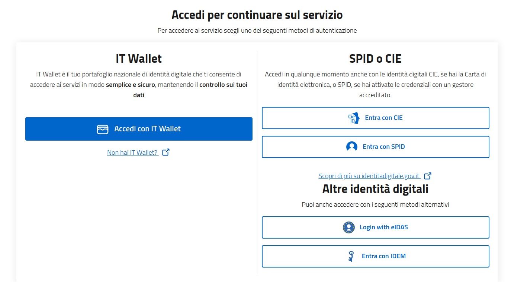

# Satosa-Saml2Spid

A SAML2/OIDC IAM Proxy based on [SATOSA](https://github.com/IdentityPython/SATOSA)
for **SAML-to-SAML**, **OIDC-to-SAML** and **SAML-to-Wallet** interoperability
with the  **Italian Digital Identity Systems**.

## Table of Contents

1. [Glossary](#Glossary)
2. [General features](#general-features)
3. [Introduction](#introduction)
4. [Demo components](#demo-components)
5. [Setup](#setup)
6. [For Developers](#for-developers)
7. [Author](#authors)
8. [Credits](#credits)


## Glossary

- **Frontend**, SAML2 Identity Provider, OpenID Connect Provider.
- **Backend**, SAML2 Service Provider, OpenID Connect Relying Party, Wallet Relying Party.
- **TargetRouting**, a SATOSA microservice for selecting the output backend to reach the endpoint (IdP) selected by the user.
- **Discovery Service**, interface that allows users to select the authentication endpoint.


## General features

Backends:

- SPID SP
- CIE SP
- FICEP SP (eIDAS 1.0)
- SAML2 SP
- EUDI Wallet (eIDAS 2.0, experimental and not intended for production use)

Frontends:

- SAML2 IDP
- OIDC OP (see [satosa-oidcop](https://github.com/UniversitaDellaCalabria/SATOSA-oidcop))

This project is tested in Continuous Integration using [spid-sp-test](https://github.com/italia/spid-sp-test),
with Metadata, Authn Requests and Responses.

## Introduction

Satosa-Saml2 Spid is an intermediate between many SAML2/OIDC 
Service Providers and many SAML2 Identity Providers.
It allows traditional Saml2 Service Providers to communicate with
**Spid**, **CIE** and **eIDAS** Identity Providers adapting Metadata and AuthnRequest operations.


**Figure1** : _Traditional SAML2 Service Providers (SPs) proxied through the SATOSA SPID Backend gets compliances on AuthnRequest and Metadata operations_.

This solution configures multiple proxy _frontends_ and _backends_
to get communicating systems that, due to protocol or specific
limitations, traditionally could not interact each other.


## Demo components

The example project comes with some preconfigured static pages.



for other page screenshots, see [here](README-GALLERY.md).

These demo pages are static files, available in `example/static`.
To get redirection to these pages, or redirection to third-party services, it is required to configure the files below:

- file: `example/proxy_conf.yml`, example value: `UNKNOW_ERROR_REDIRECT_PAGE: "https://static-contents.example.org/error_page.html"`
- file: `example/plugins/{backends,frontends}/$filename`, example value: `disco_srv: "https://static-contents.example.org/static/disco.html"`


## Usage

The average time to set up this project for your needs takes roughly 1 hour. 
This time may vary depending on your configuration, how many backend and 
frontend you configure, the machine's resources and the type of network 
connection for the download of the docker images.

For the setup of this project, the following dependency must be installed in your machine:
  
  - Python 3.10 or higher
  - Git
  - Docker

### Setup

If you want to deploy Satosa-Saml2SPID without using Docker, all the setup instructions for your Satosa-Saml2spid configuration are available in [README-SETUP.md](README-Setup.md).

### Docker Compose

This project uses Docker, all the instructions to configure this project using the official docker images are available [here](Docker-compose/README.md).

The docker compose uses the enviroment variables as documented [here](README-Setup.md#configuration-by-environment-variables) 
to configure Satosa-Saml2Spid.


### Setup a Djangosaml2 example Service Provider

This project provides an example SAML2 Service Provider for demo purposes, 
this Service Provider is executed by default in the Docker Compose.

For any further detail about its configuration, see [example_sp/djangosaml2_sp/README.md](example_sp/djangosaml2_sp/README.md).

Below the demo using the djangosaml2 Service Provider with the Wallet authentication [OpenID4VP ](https://openid.net/specs/openid-4-verifiable-presentations-1_0.html).


## For Developers

If you're running tests and you don't want to pass through the Discovery page each time you can use `idphinting` if your SP support it.
Below an example using a djangosaml2 Service Provider:

```
https://localhost/saml2/login/?idp=https://localhost/Saml2IDP/metadata&next=/saml2/echo_attributes&idphint=https%253A%252F%252Flocalhost%253A8080
```

If you're going to test Satosa-Saml2Spid with spid-sp-test, take a look to
[.github/workflows/python-app.yml](.github/workflows/python-app.yml).

If you are using this project as a testing tool or playground for [eudi-wallet-it-python](https://github.com/italia/eudi-wallet-it-python) or any other of its Python dependencies, take a look [here](README-Python-Dev.md)

Additional information can be found [here](README-DEV.md).

### Warnings

Here something that you should know before start.

- You must enable more than a single IdP (multiple metadata or single metadata with multiple entities) to get *Discovery Service* working.
- Proxy doesn't handle SAML2 SLO, so the spidSaml2 backend is configured with Authnforce -> True. For any further information see [Single Logout in Satosa](https://github.com/IdentityPython/SATOSA/issues/211).
- SATOSA Saml2 backend configuration has a **policy** section that will let us to define specialized behaviours
  and configuration for each SP (each by entityid). In this example I defined a single "default" behaviour with attributes **name_format**
  to **urn:oasis:names:tc:SAML:2.0:attrname-format:uri**, due to my needs to handle many service providers for which it could be painfull do a static definition each time.
  An additional "hack" have been made in `example/attributes-maps/satosa_spid_uri_hybrid.py`, where I adopted a hybrid mapping that works for
  both *URI* and *BASIC* formats. Feel free to customized or decouple these format in different files and per SP.

## External references


### Satosa-Saml2Spid tutorials

- [Corso-OIDC-in-IDEM-via-Proxy](https://github.com/IDEM-GARR-AAI/Corso-OIDC-in-IDEM-via-Proxy/)
- [Satosa-Saml2Spid installation tutorial](https://github.com/aslbat/Satosa-SPID-Proxy).

### SATOSA Official Documentation

- [SaToSa Saml2Saml Documentation](https://github.com/IdentityPython/SATOSA/blob/master/doc/one-to-many.md)
- [Use cases](https://github.com/IdentityPython/SATOSA/wiki#use-cases)

### Account Linking

- [pyMultiLDAP SaToSa MS](https://github.com/peppelinux/pyMultiLDAP/tree/master/multildap/satosa)
- Attributes Processing with [SATOSA-uniext](https://github.com/UniversitaDellaCalabria/SATOSA-uniExt/blob/master/satosa_uniext/processors/unical_attribute_processor.py)

### Additional resources

- [satosa-eidas-ansible](https://github.com/grnet/satosa-eidas-ansible)
- [aws-saml-proxy](https://github.com/senorkrabs/aws-saml-proxy)
- [satosa-oidc-to-sam](https://github.com/daserzw/satosa-oidc-to-saml)
- [SaToSa training aarc project](https://aarc-project.eu/wp-content/uploads/2019/03/SaToSa_Training.pdf)
- [IDP/SP Discovery service](https://medium.com/@sagarag/reloading-saml-idp-discovery-693b6bff45f0)
- https://github.com/IdentityPython/SATOSA/blob/master/doc/README.md#frontend
- [saml2.0 IdP and SP for tests](https://samltest.id/)
- https://www.spid.gov.it/assets/download/SPID_QAD.pdf

## Authors

- Giuseppe De Marco
- Andrea Ranaldi and his Team @ ISPRA Ambiente
- Stefano Colagreco @ CNR 

## Acknowledgments

- Salvatore Laiso
- Fulvio Scorza and his Team @ Università del Piemonte Orientale
- Paolo Smiraglia (SPID certs)
- Identity Python Community (pySAML2 and SATOSA)
- GARR IDEM Community
