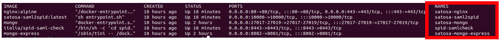
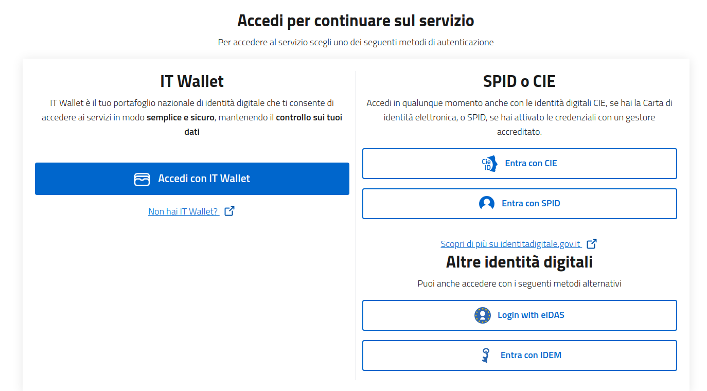

### Pre-requirements

Make sure that the following Docker containers are up and running 

> **NOTE**
> - use the following command to check if everythings is correctly running ``docker ps -a``
> - use the following command to start a stopped container ``docker start <NAME>``

if everything is okay, you will be able to access the login Saml2 service provider page

### To log in, follow the steps described in the image below:

> #### NOTE:
>
> - Use "Entra con SPID" and select "Spid_Test" Method 
> - Use the following credential -> user: validator | psw: validator
> - Use the following link to Load Metadata `https://satosa-nginx/spidSaml2/metadata`
>

