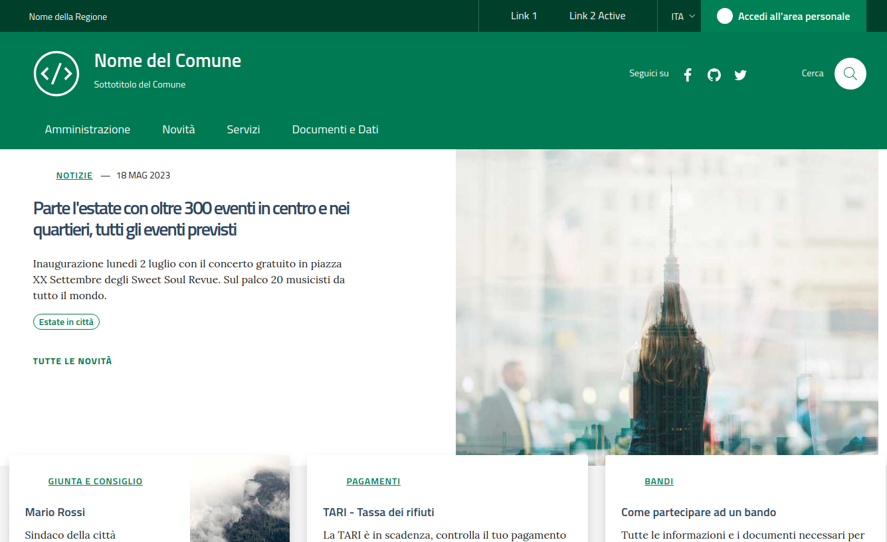

# How to run the Demo Django template


 Within the directory `/{your path}/Satosa-Saml2Spid/example_sp` execute the following commands

### djangosaml2-sp (SP server)
````
sudo apt install xmlsec1 python3-dev python3-pip libssl-dev
pip3 install virtualenv

virtualenv -ppython3 env
source env/bin/activate

cd djangosaml2_sp
# download idp metadata to sp, not needed if remote options is enabled
wget https://localhost/Saml2IDP/metadata/ -O saml2_sp/saml2_config/satosa-saml2spid.xml --no-check-certificate

# install prerequisite
pip install -r requirements.txt

# migrate django DB
python manage.py migrate

# run the sp test
./manage.py runserver 0.0.0.0:8000
````

At the end of the execution, the server will be started at the following link: http://0.0.0.0:8000
and you will be able to view the project's demo page (see below)





Now click on "Accedi all'area personale" (at the top right of the page header). 
You will be redirect to the Saml2 Service Provider page [Service Provider page](../../example/README.md)


### Add SP metadata to Satosa server
```
# put sp metadata to satosa 
wget http://localhost:8000/saml2/metadata -O #{Satosa root}/metadata/sp/djangosaml2_sp
```
