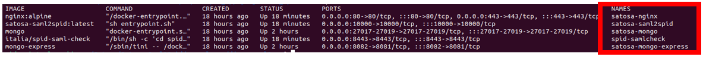

### Pre-requirements

Before starting, make sure that the following Docker containers are up and running 



> **NOTE**
> - use the following command to check if everythings is correctly running ``docker ps -a``
> - use the following command to start a stopped container ``docker start <NAME>``


if everithings is ok, go to the path `/{your path}/Satosa-Saml2Spid/example_sp` and execute the following commands


### djangosaml2-sp (SP server)
````
sudo apt install xmlsec1 python3-dev python3-pip libssl-dev
pip3 install virtualenv

virtualenv -ppython3 env
source env/bin/activate

cd djangosaml2_sp
# download idp metadata to sp, not needed if remote options is enabled
wget https://localhost/Saml2IDP/metadata/ -O saml2_sp/saml2_config/satosa-saml2spid.xml --no-check-certificate

# install prerequisite
pip install -r requirements.txt

# migrate django DB
python manage.py migrate

# run the sp test
./manage.py runserver 0.0.0.0:8000
````

At the end of the execution, the server will be started at the following link: http://0.0.0.0:8000
and you will be able to view the project's demo page (see below)


### Now you will be able to make your first login, follow these simple steps:


> :bulb: **Note:** 
1 Use "Entra con SPID" and select "Spid_Test" Method 
2 Use the following credential -> user: validator psw: validator
3 Use the following link to Load Metadata `https://satosa-nginx/spidSaml2/metadata`
4 have fun!!
<hr>


### Add SP metadata to Satosa server
```
# put sp metadata to satosa 
wget http://localhost:8000/saml2/metadata -O #{Satosa root}/metadata/sp/djangosaml2_sp
```
